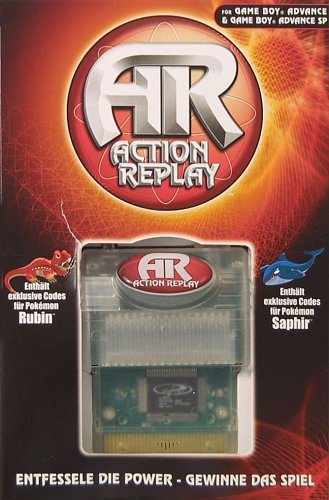
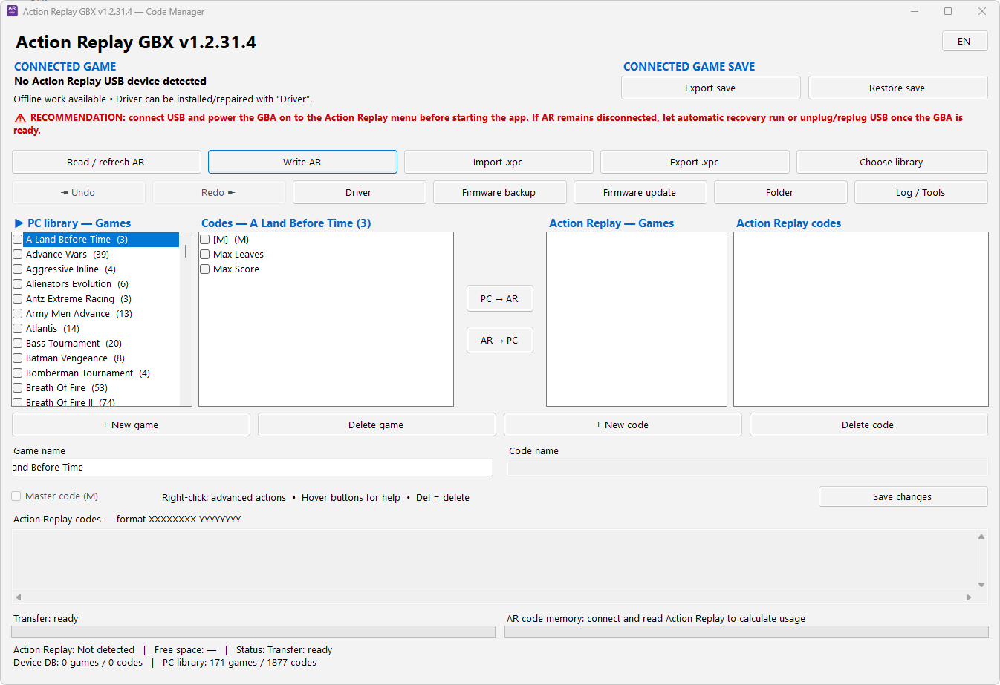

# Action Replay GBA / GBX — Windows 11

<p align="center">
   
</p>

---

Modern **Windows 11 x64** manager for Datel Action Replay GBA/GBX devices featuring the legacy USB interface. An independent **interoperability, preservation, and reverse-engineering** project, built around **Microsoft WinUSB** and notably inspired by [`kirschju/gameshark-gba-tooling`](https://github.com/kirschju/gameshark-gba-tooling).

> **Latest project version: v1.2.31.4**
> **Release:** [ActionReplayGBX v1.2.31.4](https://github.com/fumoffu80/ActionReplayGBX---W11/releases/tag/v1.2.31.4)
> This project is not affiliated with **Datel**, **CodeJunkies**, or **Nintendo**.

---

Gestionnaire moderne **Windows 11 x64** pour les Action Replay GBA/GBX Datel équipés de l’interface USB historique. Projet indépendant d’**interopérabilité, préservation et rétro-ingénierie**, développé autour de **Microsoft WinUSB** et inspiré notamment du travail de [`kirschju/gameshark-gba-tooling`](https://github.com/kirschju/gameshark-gba-tooling).

> **Version la plus récente du projet : v1.2.31.4**
>
> **Release :** [ActionReplayGBX v1.2.31.4](https://github.com/fumoffu80/ActionReplayGBX---W11/releases/tag/v1.2.31.4)
>
> Le projet n’est affilié ni à **Datel**, ni à **CodeJunkies**, ni à **Nintendo**.

---

# English

## Download the latest release

Release **v1.2.31.4** provides four separate files:

- `ActionReplayGBX Setup v1.2.31.4.exe` — Windows installer;
- `ActionReplayGBX Portable v1.2.31.4.zip` — portable build;
- `ActionReplayGBX Source v1.2.31.4.zip` — release sources, including the exact C# sources compiled under `exact-build-sources-v12314`;
- `ActionReplayGBX SHA256 v1.2.31.4.txt` — SHA-256 checksums.

➡️ **[Download ActionReplayGBX v1.2.31.4](https://github.com/fumoffu80/ActionReplayGBX---W11/releases/tag/v1.2.31.4)**

> The executables are not Authenticode-signed yet. Some antivirus engines may therefore report heuristic detections, especially because the software performs WinUSB, driver/UAC and PnP recovery operations. Verify the published SHA-256 checksums and source code when needed.

---

## ⚠️ General disclaimer

This software is provided **without warranty**. It communicates with legacy hardware and can read or write persistent data in an Action Replay or GBA cartridge.

Before any write operation:

- back up important data;
- make sure power is stable;
- use a reliable USB cable;
- never unplug the Action Replay during a write;
- keep at least one known-good full backup.

A driver problem, USB interruption, power loss, incompatible file or wrong hardware revision may cause **data loss** or leave the device unusable.

### ⚠️ CRITICAL WARNING — Firmware update / firmware writing

Firmware writing is the highest-risk operation in this project. **An incompatible firmware can brick the Action Replay.**

Before flashing:

1. make a **verified full 256 KiB dump** of your device;
2. keep multiple copies of that dump;
3. verify the hardware revision, Flash capacity and firmware family;
4. never assume compatibility merely because two units look identical;
5. never disconnect USB, power off the GBA, remove the Action Replay or interrupt the program while Flash programming is active;
6. never write a 512 KiB image to a 256 KiB device;
7. a valid Datel `.gsu` container is **not automatically firmware** — authentic GSAU containers have also been observed carrying code databases.

The firmware-update function added to this project uses the official mechanism observed both in Datel firmware and the historical Action Replay GBX PC software: **`CBW 0x14`**.

---

## Project purpose

The original Datel Action Replay GBX software is no longer suitable for current Windows versions. This project provides a modern, documented interface for:

- communication through **WinUSB**;
- game/code database management;
- **XPC** import/export;
- GBA save backup/restore;
- Action Replay Flash dumps;
- historical USB/firmware research;
- safer handling of compatible firmware updates;
- preservation of technical knowledge about this hardware family.

---

## Main features

- PC and Action Replay libraries shown side-by-side.
- XPC import/export.
- Drag-and-drop and manual game/code editing.
- Selective PC ↔ Action Replay transfer.
- Game/code creation, editing and deletion.
- Master-code `(M)` handling.
- Automatic sorting.
- French / English UI.
- Connected GBA game detection and metadata display.
- Automatic GBA **box-art** download/cache, using GameDB then Libretro fallback with explicit TLS 1.2.
- `Journal / Outils`, WinUSB/GUID diagnostics and clear-log action.
- GBA save backup/restore with visible progress.
- Read-only full Action Replay Flash backup.
- Write verification through read-back.
- WinUSB install/repair tools.
- Automatic USB recovery through engine reconnect and PnP device restart when required.
- Firmware-update workflow with pre-flash backup and validation.
- Compatible raw `.bin` firmware support.
- Historical Datel `.gsu` support with decryption and CRC validation.

---

## Software architecture

The historical codebase through **v1.2.16** is primarily written in **Go**. The current **v1.2.31.4** release is a **C# / .NET Framework / WinForms** Windows 11 x64 port while preserving the validated Datel USB command sequence.

Current release sources are mainly organized as:

```text
.port-v1231/       WinForms UI, XPC model, localization, driver and current fixes
.port-v1229/       C# USB engine / low-level protocol implementation
.github/workflows/ reproducible Windows builds and automated validation
```

The low-level engine handles USB discovery, Datel commands, code databases, GBA saves, Flash dumping and firmware validation/writing. The v1.2.31.4 source ZIP also includes `exact-build-sources-v12314`, containing the exact C# files passed to the compiler.

---

## USB protocol

The project targets the historical **Action Replay GBA / GBX USB** family, especially transparent units with a side USB Type-B connector.

`gameshark-gba-tooling` was a major reference during protocol reconstruction:

https://github.com/kirschju/gameshark-gba-tooling

Observed historical USB VID/PID:

```text
05FD:DAAE
```

Commands use headers built around ASCII `CBW` followed by a command identifier.

The analyzed Datel firmware contains strings such as:

```text
Waiting For USB Command
USB Working
USB ERROR
ADD NEW GAME
ADD NEW CODE
Press START to Play Game
```

---

## Observed Flash layout

A real Action Replay GBA dump displaying **v4.0** in its options was analyzed as a private research sample.

Total size:

```text
0x40000 = 262,144 bytes = 256 KiB = 2 Mbit
```

Observed layout:

```text
0x00000 ──────────────────────────────
        system firmware / program
        128 KiB
0x20000 ──────────────────────────────
        game / code database
        128 KiB
0x40000 ──────────────────────────────
```

The private research dump is **not stored or redistributed** in the public repository.


---

## Likely Flash chip: SST39VF200A

The available evidence strongly suggests an **SST39VF200A**-class 2 Mbit / 256 KiB Flash device for this hardware generation:

- the observed total capacity matches 2 Mbit;
- preserved v3.1/v3.3 USB Type-B Action Replay hardware is documented with SST39VF200A;
- programming sequences found in the firmware match the SST39VF family.

However, a 256 KiB software dump **does not by itself prove the physical chip model**, because the reference tooling explicitly reads `0x40000` bytes.

Definitive identification requires the physical marking or JEDEC ID.

```text
Manufacturer : 0x00BF
SST39VF200A : 0x2789   2 Mbit / 256 KiB
SST39VF400A : 0x2780   4 Mbit / 512 KiB
SST39VF800A : 0x2781   8 Mbit / 1 MiB
```

---

## Hardware generations

Preserved material demonstrates that later Action Replay hardware used larger Flash devices.

| Version / hardware | Documented Flash | Size |
|---|---|---:|
| Action Replay v3.3 USB Type-B | SST39VF200A | 256 KiB |
| researched v4.0 unit | likely same family | 256 KiB dump |
| Action Replay v4.1 | existence confirmed, dump still sought | unknown |
| Action Replay v5.8 USB Type-B | SST39VF400A | 512 KiB |
| some Ultimate Codes hardware | SST39VF800A | 1 MiB |

Therefore, a newer firmware version must **not** be assumed compatible with older hardware.

---

## Datel `.gsu` / `GSAU` format

The historical Datel software uses **Firmware Upgrade File (`*.gsu`)** files.

Static analysis identified containers beginning with:

```text
GSAU
```

A typical observed size is:

```text
131,080 bytes = 0x20008
```

The 128 KiB payload is encrypted/protected and validated with **CRC32 IEEE** after decryption.

Two authentic GSAU containers extracted from Datel software were found to contain different payload types:

- one contained executable firmware;
- one contained a game/code database.

Therefore:

> valid GSAU + valid decryption + valid CRC does **not** automatically mean firmware.

v1.2.16 adds additional checks for ARM firmware structure and known internal firmware markers before allowing a system write.

---

## GSU encryption

The analyzed GSU format uses a transformation based on **TEA (Tiny Encryption Algorithm)**.

The modern tool can:

1. detect the GSAU signature;
2. decrypt the payload;
3. calculate CRC32 IEEE;
4. validate the expected CRC;
5. check whether the result actually resembles GBX firmware;
6. reject the file when safety checks fail.

---

## Official firmware command: `CBW 0x14`

The firmware-write command was independently found in:

- the analyzed v4.0 firmware;
- the historical official Datel `ActionReplayGBX.exe`.

Command header:

```text
43 42 57 14 00 00 00 00
 C  B  W 14
```

The official PC software prepares **128 KiB** of firmware, transfers it, computes CRC32 IEEE and sends the final CRC before Flash programming.

Historical strings include:

```text
Writing to flash..
%d / 128K done..
```

This supports the observed separation between the 128 KiB system area and the 128 KiB code-database area.

---

## Why full dump = 256 KiB while firmware update = 128 KiB

```text
Full Flash dump:
[ 128 KiB firmware ][ 128 KiB codes ] = 256 KiB

CBW 0x14 firmware update:
[ 128 KiB firmware ] only
```

The firmware update therefore does not need to overwrite the code database.

---

## Supported firmware input concepts

Recent versions support or validate the following concepts:

- raw **128 KiB `.bin`** system firmware;
- **256 KiB `.bin`** full Flash dump, with the first half treated as system firmware where appropriate;
- Datel **`.gsu`** container with decryption and CRC validation;
- explicit rejection of obviously incompatible **512 KiB** images in the 256 KiB hardware path.

---

## Firmware backup

Firmware backup is non-destructive.

Recent versions read the complete 256 KiB Flash image, validate the expected length and compute hashes before considering the backup successful.

A verified full dump should always be made **before the first firmware write**.

---

## Research methodology

The documentation combines:

1. analysis of a real v4.0 dump;
2. ARM static disassembly;
3. extraction of the original Datel installer without executing it;
4. static analysis of `ActionReplayGBX.exe`;
5. comparison with `gameshark-gba-tooling`;
6. comparison with LibreShark preserved dumps;
7. documented PCB/dump projects;
8. SST/Microchip datasheets;
9. period reports for otherwise lost version information.

Claims are intentionally separated into **observed facts**, **strong deductions**, and **unverified compatibility hypotheses**.

---

## Useful sources

- https://github.com/kirschju/gameshark-gba-tooling
- https://github.com/LibreShark/sharkdumps
- https://github.com/RWeick/GBA-Action_Replay-REF1512B
- https://ww1.microchip.com/downloads/aemDocuments/documents/MPD/ProductDocuments/DataSheets/SST39LFX00A-SST39VFX00A-2-Mbit-4-Mbit-8-Mbit-x16-Multi-Purpose-Flash-DS20005001.pdf
- https://wiki.gamehacking.org/Action_Replay_GBA_2002_Software
- https://archive.org/details/action-replay-gbx

---

## Intellectual property / preservation

This repository documents protocols and behavior needed for interoperability with legacy hardware.

Proprietary Datel firmware is not intentionally redistributed here without an appropriate legal basis. The analyzed v4.0 dump remains a **private research sample** and is not stored in the public repository; only derived technical observations are published.

**Action Replay**, **Datel**, **CodeJunkies**, **Nintendo**, **Game Boy Advance**, and related proprietary software/firmware remain the property of their respective owners.


---

# Français

## Télécharger la dernière version

La release **v1.2.31.4** fournit quatre fichiers distincts :

- `ActionReplayGBX Setup v1.2.31.4.exe` — installateur Windows ;
- `ActionReplayGBX Portable v1.2.31.4.zip` — version portable ;
- `ActionReplayGBX Source v1.2.31.4.zip` — sources de la release, avec les sources C# exactes réellement compilées dans `exact-build-sources-v12314` ;
- `ActionReplayGBX SHA256 v1.2.31.4.txt` — empreintes SHA-256 des livrables.

➡️ **[Télécharger ActionReplayGBX v1.2.31.4](https://github.com/fumoffu80/ActionReplayGBX---W11/releases/tag/v1.2.31.4)**

> Les exécutables ne sont pas encore signés Authenticode. Certains moteurs antivirus peuvent donc produire des détections heuristiques, notamment à cause des fonctions WinUSB, pilote/UAC et récupération PnP. Vérifiez les SHA-256 publiés et les sources si nécessaire.

---

## ⚠️ Avertissement général

Ce logiciel est fourni **sans garantie**. Il communique avec du matériel ancien et peut lire ou écrire des données persistantes dans l’Action Replay ou dans une cartouche GBA.

Avant toute opération d’écriture :

- sauvegardez les données importantes ;
- vérifiez que le périphérique est correctement alimenté ;
- utilisez un câble USB fiable ;
- ne débranchez pas l’Action Replay pendant une écriture ;
- conservez au moins une sauvegarde complète connue comme valide.

Une erreur de pilote, une coupure USB, une coupure d’alimentation, un fichier incompatible ou une mauvaise révision matérielle peut provoquer une **perte de données** ou rendre le périphérique inutilisable.

### ⚠️ AVERTISSEMENT CRITIQUE — Mise à jour / écriture du firmware

L’écriture du firmware est l’opération la plus risquée du projet. **Un mauvais firmware peut bricker l’Action Replay.**

Avant de flasher :

1. effectuez un **dump complet vérifié de 256 Kio** de votre appareil ;
2. conservez ce dump à plusieurs endroits ;
3. vérifiez la **révision matérielle**, la **capacité de Flash** et la famille de firmware ;
4. ne supposez jamais qu’un firmware trouvé sur Internet est compatible uniquement parce que le boîtier ressemble au vôtre ;
5. ne débranchez **jamais** l’USB, n’éteignez **jamais** la GBA et ne retirez **jamais** l’Action Replay pendant la programmation ;
6. n’écrivez jamais une image 512 Kio sur un appareil 256 Kio ;
7. un fichier `.gsu` Datel valide n’est **pas automatiquement un firmware** : des conteneurs GSAU ont aussi été observés pour des bases de codes.

La fonction de mise à jour du firmware ajoutée au projet utilise la commande officielle observée dans le firmware Datel et dans le logiciel historique Action Replay GBX : **`CBW 0x14`**.

---

## Objectif du projet

L’ancien logiciel Datel Action Replay GBX n’est plus adapté aux versions modernes de Windows. Ce projet vise à fournir une interface moderne et documentée permettant notamment de :

- communiquer avec l’Action Replay via **WinUSB** ;
- gérer les jeux et codes présents dans l’appareil ;
- importer/exporter des bases **XPC** ;
- sauvegarder et restaurer les sauvegardes GBA ;
- sauvegarder la Flash de l’Action Replay ;
- analyser le firmware et le protocole USB historique ;
- prendre en charge les mises à jour firmware compatibles avec des protections supplémentaires ;
- préserver les connaissances techniques sur cette famille de matériel.

---

## Fonctions principales

- Bibliothèque PC et contenu de l’Action Replay affichés simultanément.
- Import/export **XPC**.
- Glisser-déposer et édition manuelle des jeux/codes.
- Transfert sélectif PC ↔ Action Replay.
- Création, modification et suppression de jeux et codes.
- Gestion du code maître `(M)`.
- Tri alphabétique automatique.
- Français / English.
- Détection du jeu GBA connecté.
- Affichage des métadonnées du jeu connecté et téléchargement/cache de la **jaquette GBA**, avec GameDB puis Libretro en secours et TLS 1.2 explicite.
- `Journal / Outils`, diagnostic WinUSB/GUID et bouton `Effacer log`.
- Sauvegarde et restauration des sauvegardes GBA avec progression visible.
- Sauvegarde complète de la Flash Action Replay en lecture seule.
- Vérification des écritures par relecture.
- Installation/réparation du pilote **WinUSB**.
- Récupération USB automatique : reconnexion par le moteur puis redémarrage PnP du périphérique si nécessaire.
- Mise à jour firmware avec sauvegarde préalable et contrôles de cohérence.
- Support des firmwares bruts `.bin` compatibles.
- Support du format historique Datel `.gsu` avec déchiffrement et vérification CRC.

---

## Architecture du logiciel

La branche historique jusqu’à **v1.2.16** est principalement écrite en **Go**. La release actuelle **v1.2.31.4** utilise un port **C# / .NET Framework / WinForms** pour Windows 11 x64, tout en conservant la séquence du protocole USB Datel validée lors du portage.

Les sources de la release actuelle sont principalement organisées ainsi :

```text
.port-v1231/       interface WinForms, modèle XPC, localisation, pilote et correctifs actuels
.port-v1229/       moteur USB C# / logique bas niveau
.github/workflows/ builds Windows reproductibles et tests automatisés
```

Le moteur bas niveau gère notamment la découverte WinUSB, les commandes USB Datel, les bases de codes, les sauvegardes GBA, les dumps Flash et la validation/écriture firmware.

Le helper pilote vérifie WinUSB et le GUID d’interface, peut réparer l’installation et redémarrer le périphérique via PnP. Le ZIP source v1.2.31.4 contient aussi `exact-build-sources-v12314`, avec les fichiers C# exacts réellement passés au compilateur.

---

## Matériel et protocole USB

Le projet cible la famille **Action Replay GBA / GBX USB** historique, notamment les appareils transparents utilisant un connecteur USB Type-B latéral.

Le projet `gameshark-gba-tooling` a été une référence importante pour reconstruire le protocole :

- dépôt : https://github.com/kirschju/gameshark-gba-tooling
- périphérique USB historique observé : VID/PID `0x05FD / 0xDAAE` ;
- commandes construites autour d’en-têtes ASCII de type `CBW` suivis d’un identifiant de commande.

Le firmware Datel analysé contient notamment les chaînes :

- `Waiting For USB Command`
- `USB Working`
- `USB ERROR`
- `ADD NEW GAME`
- `ADD NEW CODE`
- `Press START to Play Game`

Ces éléments confirment que la couche USB n’est pas une simple interface de stockage : le périphérique exécute son propre protocole de commandes.

---

## Structure de la Flash observée

Un dump réel d’un Action Replay GBA affichant **v4.0** dans les options a été analysé comme échantillon de recherche privé.

Taille totale :

```text
0x40000 = 262 144 octets = 256 Kio = 2 Mbit
```

Organisation observée :

```text
0x00000 ──────────────────────────────
        Firmware / programme système
        128 Kio
0x20000 ──────────────────────────────
        Base jeux / codes
        128 Kio
0x40000 ──────────────────────────────
```

Autrement dit :

| Zone | Taille | Usage observé |
|---|---:|---|
| `0x00000–0x1FFFF` | 128 Kio | firmware / système |
| `0x20000–0x3FFFF` | 128 Kio | jeux et codes |
| total | 256 Kio | Flash complète |

Le dump de recherche privé n’est **ni stocké ni redistribué** dans le dépôt public. Seuls les résultats techniques dérivés sont documentés.


Des entrées de la base de codes ont été retrouvées dans la seconde moitié, dont des entrées Pokémon françaises.

---

## Quel modèle de Flash ?

### Hypothèse la plus probable : SST39VF200A

Les données disponibles rendent le **SST39VF200A** très plausible pour cette génération :

- capacité : **2 Mbit = 256 Kio** ;
- organisation compatible avec le dump observé ;
- des Action Replay GBA USB Type-B v3.1/v3.3 préservés utilisent explicitement cette puce ;
- les séquences d’effacement/programmation observées correspondent à la famille SST39VF.

Références utiles :

- https://github.com/RWeick/GBA-Action_Replay-REF1512B
- https://github.com/LibreShark/sharkdumps
- datasheet SST39VF200A/400A/800A : https://ww1.microchip.com/downloads/aemDocuments/documents/MPD/ProductDocuments/DataSheets/SST39LFX00A-SST39VFX00A-2-Mbit-4-Mbit-8-Mbit-x16-Multi-Purpose-Flash-DS20005001.pdf

### Mais attention : ce n’est pas une preuve absolue

La taille d’un dump de 256 Kio **ne suffit pas à elle seule** pour identifier physiquement la puce, car `gameshark-gba-tooling` lit explicitement `0x40000` octets.

La confirmation définitive doit venir :

- du marquage de la puce ; ou
- de son identifiant JEDEC.

Identifiants SST utiles :

```text
Manufacturer : 0x00BF
SST39VF200A : 0x2789   (2 Mbit / 256 Kio)
SST39VF400A : 0x2780   (4 Mbit / 512 Kio)
SST39VF800A : 0x2781   (8 Mbit / 1 Mio)
```

---

## Différences de générations observées

Les archives de préservation montrent clairement plusieurs capacités matérielles :

| Version / matériel | Flash documentée | Taille |
|---|---|---:|
| Action Replay v3.3 USB Type-B | SST39VF200A | 256 Kio |
| Action Replay v4.0 étudié | probablement même famille | dump 256 Kio |
| Action Replay v4.1 | existence confirmée, dump recherché | non confirmé |
| Action Replay v5.8 USB Type-B | SST39VF400A | 512 Kio |
| Action Replay Ultimate Codes | SST39VF800A observé sur certains matériels | 1 Mio |

Le dump préservé v5.8 de LibreShark fait bien **524 288 octets** et est associé au **SST39VF400A**.

Cela signifie qu’une version plus récente n’est pas automatiquement compatible avec un ancien appareil.

---

## Firmware v4.1

L’existence d’un **Action Replay GBA v4.1** est confirmée par des témoignages d’époque et des exemplaires matériels vendus comme tels.

Le but de la recherche de préservation est de retrouver :

- soit un `.gsu` officiel v4.1 ;
- soit un dump brut 256 Kio d’un appareil v4.1 de même famille matérielle.

Aucun firmware v4.1 n’est redistribué ici actuellement.

La compatibilité v4.0 → v4.1 reste donc une **hypothèse raisonnable mais non démontrée** tant qu’un dump correspondant et la révision matérielle n’ont pas été comparés.

---

## Format Datel `.gsu` / `GSAU`

L’ancien logiciel officiel Datel utilise des fichiers **Firmware Upgrade File (`*.gsu`)**.

L’analyse statique de l’installateur historique Action Replay GBX a permis d’identifier des conteneurs commençant par :

```text
GSAU
```

Taille typique observée :

```text
131 080 octets = 0x20008
```

Le conteneur contient un bloc de **128 Kio chiffré**, avec informations de contrôle associées.

Le logiciel historique Datel déchiffre le payload, puis valide son **CRC32 IEEE** avant utilisation.

### Point de sécurité important

Deux conteneurs GSAU authentiques ont été trouvés dans un installateur Datel :

- l’un déchiffre vers un **firmware exécutable** ;
- l’autre déchiffre vers une **base de codes**.

Donc :

> `GSAU valide + déchiffrement valide + CRC valide` ≠ forcément firmware.

Depuis v1.2.16, le logiciel applique également des contrôles sur la structure ARM et des marqueurs internes du firmware avant d’autoriser l’écriture système.

---

## Chiffrement GSU

Le format GSU analysé utilise une transformation basée sur **TEA (Tiny Encryption Algorithm)** pour protéger le bloc de données.

Le projet moderne :

1. reconnaît la signature GSAU ;
2. déchiffre le bloc ;
3. recalcule le CRC32 IEEE ;
4. compare le CRC attendu ;
5. vérifie ensuite que le payload ressemble réellement à un firmware GBX ;
6. refuse le fichier si les garde-fous échouent.

Cette prise en charge est destinée à l’interopérabilité et à la préservation de fichiers légitimement obtenus.

---

## Commande officielle de mise à jour firmware : `CBW 0x14`

L’un des résultats les plus importants de la rétro-ingénierie est la confirmation de la commande :

```text
43 42 57 14 00 00 00 00
 C  B  W 14
```

soit **`CBW 0x14`**.

Elle a été retrouvée :

1. dans le firmware v4.0 analysé ;
2. dans l’ancien exécutable officiel `ActionReplayGBX.exe` Datel.

Le logiciel officiel :

- prépare **128 Kio** de firmware ;
- transmet les données par petits blocs ;
- attend les réponses du périphérique ;
- calcule un **CRC32 IEEE** ;
- transmet le CRC final ;
- le périphérique effectue ensuite la programmation Flash.

Le logiciel officiel affiche notamment :

```text
Writing to flash..
%d / 128K done..
```

Ce comportement confirme que la mise à jour firmware vise la **première moitié de 128 Kio**, sans nécessiter de réécrire la base de codes 128 Kio.

---

## Pourquoi la sauvegarde complète fait 256 Kio mais la mise à jour firmware 128 Kio ?

Parce que les deux opérations ne couvrent pas la même chose :

```text
Dump complet :
[ 128 Kio firmware ][ 128 Kio codes ] = 256 Kio

Mise à jour firmware CBW 0x14 :
[ 128 Kio firmware ] uniquement
```

Le logiciel peut donc :

- sauvegarder la Flash complète pour restauration/recherche ;
- n’écrire que la partie système lors d’une mise à jour firmware ;
- laisser la base de codes intacte.

---

## Formats firmware acceptés par les versions récentes

Selon la version du projet :

### `.bin` 128 Kio
Firmware système brut.

### `.bin` 256 Kio
Dump Flash complet ; la zone système correspond aux 128 premiers Kio.

### `.gsu`
Conteneur historique Datel : déchiffrement + CRC + validation supplémentaire.

### 512 Kio
Refusé sur le chemin destiné aux appareils 256 Kio afin d’éviter une erreur évidente de génération matérielle.

---

## Sauvegarde du firmware

La fonction **Sauvegarde Firmware** est non destructive.

Les versions récentes :

- lisent la Flash complète ;
- exigent exactement **262 144 octets** pour le format étudié ;
- ne valident le fichier final qu’après lecture complète ;
- calculent des empreintes CRC32/SHA-256 ;
- permettent de distinguer les zones système et codes.

Il est fortement recommandé de faire cette opération **avant toute première écriture firmware**.

---

## Bases XPC

Le logiciel gère les bibliothèques historiques de codes dans le format **XPC** utilisé par Action Replay GBX.

Le projet peut contenir plusieurs bibliothèques distinctes afin de ne pas mélanger automatiquement des bases dont la provenance ou la compatibilité diffère.

Les opérations de réécriture de codes sont distinctes de l’écriture firmware.

---

## Sécurité des écritures

Pour les fonctions classiques :

- backup avant écriture lorsque possible ;
- envoi par blocs ;
- synchronisation ;
- relecture ;
- comparaison des données écrites.

Pour le firmware, les protections supplémentaires comprennent notamment :

- sauvegarde complète obligatoire dans le workflow prévu ;
- contrôle de taille ;
- contrôle GSAU/CRC pour les `.gsu` ;
- vérification de signatures/chaînes typiques du firmware ;
- refus des images 512 Kio sur le chemin 256 Kio ;
- commande d’écriture volontairement séparée et protégée.

Aucun garde-fou logiciel ne peut toutefois rendre un flash matériel **sans risque**.

---

## Connexion recommandée

Pour la meilleure stabilité :

1. insérer l’Action Replay dans la GBA ;
2. insérer éventuellement la cartouche GBA dans l’Action Replay ;
3. brancher l’USB ;
4. allumer la GBA ;
5. attendre le menu principal Action Replay ;
6. lancer l’application.

L’interface USB peut parfois être visible alors que le firmware de l’Action Replay n’est pas encore prêt à accepter les commandes.

---

## Compilation

### Release actuelle v1.2.31.4

Le build de référence est exécuté sous Windows avec le compilateur C# du **.NET Framework** (`csc.exe`) et les assemblies WinForms/System.Drawing/System.Management. L’installateur est généré avec **Inno Setup**.

Le workflow compile le modèle, le moteur USB, le helper pilote et la GUI, puis exécute les tests XPC, interface et jaquette réseau réelle avant de construire les quatre livrables.

La dépendance `wdi-simple.exe` est épinglée et vérifiée :

```text
SHA-256 2baf73145c8800a3a60a3dd50ac589337f18ac7c31fdc8c70d525ca0ff41ce81
```

Le ZIP source v1.2.31.4 contient `exact-build-sources-v12314`, c’est-à-dire les sources C# exactes réellement passées au compilateur.

### Sources historiques v1.2.16

Les sources historiques Go restent conservées comme référence ; leur compilation nécessite **Go 1.23+**.

---

## Historique des versions du projet

Les versions historiques actuellement documentées comprennent notamment :

```text
v1.1.3
v1.2.0
v1.2.1
v1.2.4
v1.2.5
v1.2.7
v1.2.8
v1.2.9
v1.2.10
v1.2.11
v1.2.12
v1.2.13
v1.2.14
v1.2.15
v1.2.16
v1.2.31.2
v1.2.31.3
v1.2.31.4  ← release actuelle
```

Certaines anciennes versions n’ont pas été conservées avec tous leurs binaires originaux. Lorsqu’une version est reconstruite à partir de sources/changelogs, elle doit être présentée comme telle plutôt que comme un binaire historique byte-for-byte.

---

## Méthodologie de recherche / rétro-ingénierie

Les conclusions documentées ici proviennent de plusieurs sources croisées :

1. analyse d’un dump réel v4.0 ;
2. désassemblage statique du firmware ARM ;
3. extraction sans exécution de l’ancien installateur Datel ;
4. analyse statique de `ActionReplayGBX.exe` ;
5. comparaison avec `gameshark-gba-tooling` ;
6. comparaison avec des dumps préservés LibreShark ;
7. comparaison avec des PCB/dumps documentés par d’autres projets ;
8. datasheets SST/Microchip ;
9. forums et témoignages d’époque pour les numéros de version disparus.

### Hiérarchie de confiance utilisée

**Très forte confiance** :

- observation directe dans le firmware ou logiciel Datel ;
- dump avec provenance matérielle claire ;
- datasheet constructeur.

**Confiance moyenne** :

- plusieurs sources indépendantes cohérentes ;
- documentation technique de projets de préservation.

**Hypothèse** :

- compatibilité entre versions non testée ;
- identification de puce sans marquage physique/JEDEC ;
- numéros de versions seulement rapportés par des utilisateurs.

Cette distinction est importante : le README cherche à préserver **les faits autant que les incertitudes**.

---

## Sources et projets utiles

- `kirschju/gameshark-gba-tooling`  
  https://github.com/kirschju/gameshark-gba-tooling

- LibreShark firmware dumps  
  https://github.com/LibreShark/sharkdumps

- RWeick — GBA Action Replay REF1512B  
  https://github.com/RWeick/GBA-Action_Replay-REF1512B

- Microchip SST39LF/VF200A / 400A / 800A datasheet  
  https://ww1.microchip.com/downloads/aemDocuments/documents/MPD/ProductDocuments/DataSheets/SST39LFX00A-SST39VFX00A-2-Mbit-4-Mbit-8-Mbit-x16-Multi-Purpose-Flash-DS20005001.pdf

- GameHacking.org — ancien logiciel Action Replay GBA 2002  
  https://wiki.gamehacking.org/Action_Replay_GBA_2002_Software

- Internet Archive — Action Replay GBX CD  
  https://archive.org/details/action-replay-gbx

---

## Propriété intellectuelle et préservation

Ce dépôt documente des protocoles et comportements nécessaires à l’interopérabilité avec du matériel ancien.

Les firmwares Datel propriétaires ne sont pas destinés à être redistribués ici sans base juridique appropriée. Le dump v4.0 utilisé pour la recherche reste **privé** et n’est représenté que par ses empreintes et les observations techniques dérivées.

Les marques **Action Replay**, **Datel**, **CodeJunkies**, **Nintendo**, **Game Boy Advance**, ainsi que les logiciels/firmwares propriétaires correspondants appartiennent à leurs propriétaires respectifs.
